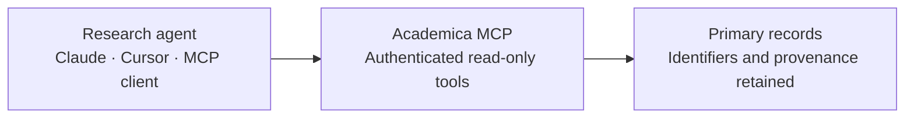

<div align="center">
  
  <h1>Academica MCP</h1>
  <p><strong>Scientific evidence infrastructure for AI agents.</strong></p>
  <p>Biomedical literature, clinical trials, physician-industry payments, and healthcare-provider records through four read-only Model Context Protocol servers.</p>

  [](https://modelcontextprotocol.io/)
  [](https://academica.sh/)
  [](https://academica.sh/mcp/keys)
  [](LICENSE)

  [Get an API key](https://academica.sh/mcp/keys) · [Documentation](https://academica.sh/mcp) · [Report an issue](https://github.com/academica-sh/academica-mcp/issues)
</div>

---

## Four evidence surfaces. One protocol.

| | Server | Evidence surface | Plugin |
|---|---|---|---|
| ◉ | **PubMed** | Biomedical citations, abstracts, authorship, journals, and identifiers | `academica-pubmed` |
| ⌁ | **Clinical Trials** | Study protocols, recruitment status, interventions, eligibility, and outcomes | `academica-clinical-trials` |
| ◇ | **Open Payments** | CMS transfers of value, manufacturers, physicians, and ownership interests | `academica-open-payments` |
| ✣ | **Healthcare Providers** | NPI identities, specialties, taxonomies, credentials, and practice locations | `academica-hcp` |

## Install one server in under a minute with Claude Code

```text
/plugin marketplace add academica-sh/academica-mcp
/plugin install academica-pubmed@academica
```

Set the API key before loading the plugin:

```bash
export ACADEMICA_API_KEY="ak_…"
```

> [!IMPORTANT]
> **One repository is the distribution authority; activation remains client-specific.** Claude Code and Codex expose four independently installable plugins. Cursor, Pi, Hermes, and the optional aggregate configurations register four named servers together and let the client control which tools remain enabled.

## From research question to cited evidence



## Hosted endpoints

| Server | Streamable HTTP endpoint | OpenAPI schema |
|---|---|---|
| PubMed | `https://academica.sh/api/mcp/pubmed` | [`openapi.json`](https://academica.sh/api/mcp/pubmed/openapi.json) |
| Clinical Trials | `https://academica.sh/api/mcp/clinical-trials` | [`openapi.json`](https://academica.sh/api/mcp/clinical-trials/openapi.json) |
| Open Payments | `https://academica.sh/api/mcp/open-payments` | [`openapi.json`](https://academica.sh/api/mcp/open-payments/openapi.json) |
| Healthcare Providers | `https://academica.sh/api/mcp/hcp` | [`openapi.json`](https://academica.sh/api/mcp/hcp/openapi.json) |

All four servers use Streamable HTTP and accept an Academica API key in the `Authorization: Bearer <key>` header.

## What a result preserves

Academica tools return structured evidence records rather than untraceable prose. Depending on the selected server, a result can retain:

- source identifiers such as PMID, NCT ID, NPI, and CMS record identifiers;
- official titles, statuses, dates, organizations, and named entities;
- study interventions, eligibility criteria, sponsors, and locations;
- payment categories, amounts, manufacturers, and covered recipients;
- provider credentials, taxonomies, specialties, and practice locations.

Source identifiers support inspection of the corresponding primary record. Retrieved records are research evidence, not medical advice, and absence from a result set does not establish absence from the underlying world.

## Client setup

<details open>
<summary><strong>Claude Code</strong></summary>

```text
/plugin marketplace add academica-sh/academica-mcp
/plugin install academica-pubmed@academica
```

Install additional evidence surfaces independently:

```text
/plugin install academica-clinical-trials@academica
/plugin install academica-open-payments@academica
/plugin install academica-hcp@academica
```
</details>

<details>
<summary><strong>Claude Team and Cowork</strong></summary>

Add each required endpoint as a Custom Web connector and provide the Academica key as Bearer authentication.

```text
Name: Academica PubMed
URL: https://academica.sh/api/mcp/pubmed
Authorization: Bearer <Academica API key>
```
</details>

<details>
<summary><strong>Cursor</strong></summary>

Install the repository as a Cursor Plugin. Under **Plugins → Configure**, set the required `ACADEMICA_API_KEY` variable. The native manifest registers all four servers without storing the key in the repository.
</details>

<details>
<summary><strong>Codex</strong></summary>

```bash
export ACADEMICA_API_KEY="ak_…"
codex plugin marketplace add academica-sh/academica-mcp
codex plugin add academica-pubmed@academica
```

The Codex marketplace contains four independently installable plugins. Each uses native `bearer_token_env_var` credential resolution.
</details>

<details>
<summary><strong>OpenCode</strong></summary>

Copy or merge one file from [`clients/opencode`](clients/opencode) into the applicable `opencode.json`. Individual-server examples and an optional all-server configuration use `{env:ACADEMICA_API_KEY}` substitution with OAuth disabled.
</details>

<details>
<summary><strong>Hermes Agent</strong></summary>

Merge [`clients/hermes/config.yaml`](clients/hermes/config.yaml) into `~/.hermes/config.yaml` and expose `ACADEMICA_API_KEY` to Hermes. Four upstream-ready catalog manifests are provided under [`clients/hermes/catalog`](clients/hermes/catalog).
</details>

<details>
<summary><strong>DeepSeek Harness</strong></summary>

```bash
export ACADEMICA_API_KEY="ak_…"
dsh plugin --profile web add github:academica-sh/academica-mcp
```

The package mounts four instances of DeepSeek's official Streamable HTTP MCP client through [`cordis.patch.yml`](cordis.patch.yml). Installation is per Harness profile.
</details>

<details>
<summary><strong>Pi</strong></summary>

```bash
export ACADEMICA_API_KEY="ak_…"
pi install git:github.com/academica-sh/academica-mcp
```

The Pi package loads an Academica extension backed by `pi-mcp-adapter`. All four servers are available; individual entries can be enabled or disabled through the adapter controls.
</details>

<details>
<summary><strong>Generic MCP clients</strong></summary>

```text
Transport: Streamable HTTP
URL: https://academica.sh/api/mcp/<server>
Header: Authorization: Bearer <Academica API key>
```

Valid server paths are `pubmed`, `clinical-trials`, `open-payments`, and `hcp`.
</details>

<details>
<summary><strong>ChatGPT Actions and OpenAPI clients</strong></summary>

Import the schema for the required evidence surface:

```text
https://academica.sh/api/mcp/pubmed/openapi.json
https://academica.sh/api/mcp/clinical-trials/openapi.json
https://academica.sh/api/mcp/open-payments/openapi.json
https://academica.sh/api/mcp/hcp/openapi.json
```

Use API Key authentication with the Bearer scheme. The privacy policy URL is `https://academica.sh/legal/privacy`.
</details>

## Client compatibility

| Client | Repository integration | Authentication | Selection model |
|---|---|---|---|
| Claude Code | `.claude-plugin/marketplace.json` plus four plugin packages | `ACADEMICA_API_KEY` environment substitution | Install each evidence surface independently |
| Cursor | `.cursor-plugin/plugin.json` | Required secret set under **Plugins → Configure** | One plugin exposes four named servers |
| Codex | `.agents/plugins/marketplace.json` plus four `.codex-plugin` manifests | Native `bearer_token_env_var` | Install each evidence surface independently |
| OpenCode | `clients/opencode/*.json` | `{env:ACADEMICA_API_KEY}` header substitution | Individual files plus optional `all.json` |
| Hermes Agent | `clients/hermes/config.yaml` | `${ACADEMICA_API_KEY}` header substitution | Four servers in one configuration |
| DeepSeek Harness | `package.json` plus `cordis.patch.yml` | Environment-backed header in the Cordis bundle | Four MCP-client instances per installed profile |
| Pi | `package.json` plus `extensions/academica-mcp.ts` | Environment-backed header through `pi-mcp-adapter` | One package; servers can be disabled individually |
| Agent Plugins | Root `plugin.json` plus `mcp.json` | Client-managed; the portable standard stores no secret references | One portable plugin declares four servers |

The portable Agent Plugins files intentionally contain no Authorization header. Clients that require bearer authentication use the native integrations listed above.

### Verified distribution gates

- Root Agent Plugins manifests validate against the 1.0.0 schemas.
- All four Codex plugins pass the Codex plugin validator; an isolated install retained `ACADEMICA_API_KEY` as the bearer-token environment variable.
- All five OpenCode configurations validate against the current OpenCode schema.
- Hermes configuration and catalog manifests parse as YAML.
- The Pi package installs from a local Git source and exports a valid extension function.
- The npm package contains the Pi extension and DeepSeek Cordis bundle; dependency audit reports zero known vulnerabilities.
- All JSON manifests parse, and no operational API key is committed.

These checks prove packaging and configuration compatibility. Directory approval, npm publication, and authenticated evidence queries are separate release gates.

## Built for evidence work

| Property | Contract |
|---|---|
| **Read-only by design** | Retrieval tools cannot modify upstream scientific or public records. |
| **Source-resolvable** | Stable identifiers support inspection of the underlying record. |
| **Scoped credentials** | User-issued keys support revocation and evidence-surface authorization. |
| **Composable** | Independent servers support focused agents and cross-surface workflows. |

## Repository map

```text
academica-mcp/
├── plugin.json                         # Open Plugins identity
├── mcp.json                            # Portable four-server MCP catalog
├── .cursor-plugin/plugin.json          # Cursor variables and authenticated MCPs
├── .agents/plugins/marketplace.json    # Codex marketplace catalog
├── .claude-plugin/marketplace.json      # Claude Code marketplace catalog
├── package.json                        # DeepSeek Harness and Pi package
├── cordis.patch.yml                    # DeepSeek MCP client bundle
├── extensions/                         # Pi MCP adapter extension
├── clients/                            # OpenCode and Hermes configurations
├── plugins/
│   ├── academica-pubmed/                # Claude and Codex plugin manifests
│   ├── academica-clinical-trials/
│   ├── academica-open-payments/
│   └── academica-hcp/
└── registry/
    ├── pubmed/server.json               # Official MCP Registry metadata
    ├── clinical-trials/server.json
    ├── open-payments/server.json
    └── hcp/server.json
```

Cloning this repository downloads distribution metadata. It does not download the evidence corpora or start local servers; the manifests connect compatible clients to Academica's hosted endpoints.

## Security and policy

- Never commit an operational API key.
- Store `ACADEMICA_API_KEY` in the client environment or its protected credential store.
- Revoke exposed or unused keys at the [API key console](https://academica.sh/mcp/keys).
- Report security concerns privately to [sid@academica.sh](mailto:sid@academica.sh).

[Privacy policy](https://academica.sh/legal/privacy) · [Terms](https://academica.sh/legal/terms) · [MIT license](LICENSE)

---

<div align="center">
  <strong>Academica</strong><br>
  Scientific evidence infrastructure for AI agents<br>
  <a href="https://academica.sh">academica.sh</a>
</div>
